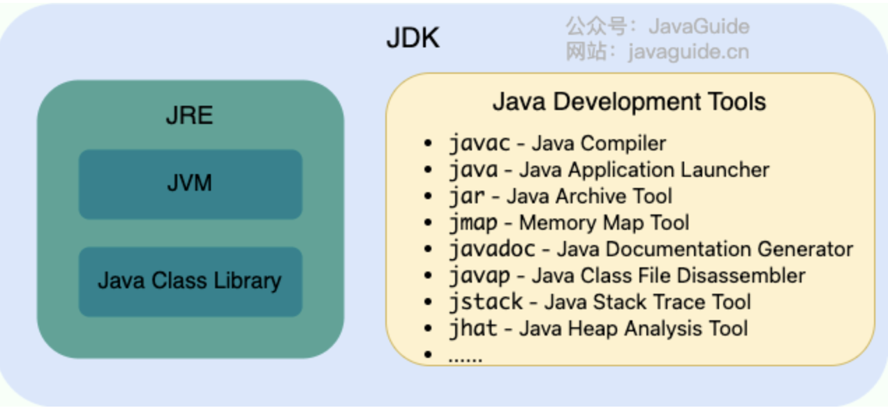

# Java

## 基础

### 从java 8 到 23

https://openjdk.org/projects/jdk/

- java 8（2014）
  - **支持Lamda表达式**
  - **提供Stream API**
  - **接口default关键字，支持接口的默认实现**
  - **引入 `java.time`**
- java 9（2017）
  - 集合工厂方法，如 `List.of()`、`Set.of()` 创建不可变集合
- java 10（2018）
  - 局部变量类型推断（`var`）：简化局部变量声明（需初始化）
  - **G1 作为默认垃圾收集器**：替代 Parallel GC
- java 11（2018）
  - **HTTP Client API**：标准化（原为 Java 9 的孵化器 API）
  - `String` 新增方法：如 `isBlank()`、`lines()`
- java 12（2019）
- java 13（2019）
  - 动态 CDS 归档：提升启动性能
- java 14（2020）
  - **Switch 表达式正式版**：支持箭头语法 `->` 和返回值
- java 15（2020）
  - **ZGC 并发线程处理**：提升 GC 性能，亚毫秒级停顿
    - 并发标记与回收：几乎所有工作（标记、压缩、引用处理）均在用户线程运行时并发执行，极大减少 STW（Stop-The-World）时间
    - 染色指针（Colored Pointers）：在指针中存储元数据（如标记状态），避免传统 GC 的内存屏障开销。
    - 内存映射（Memory Mapping）：通过多阶段内存映射实现快速内存回收
  - **Shenandoah GC**： 低延迟垃圾收集器，设计目标是 将 GC 停顿时间压缩到 10ms 级别，且停顿时间与堆大小无关
    - 并发标记与回收：几乎所有阶段（标记、清理、压缩）均与用户线程并发执行，仅初始标记和最终标记阶段有短暂 STW（Stop-The-World）停顿
    - 转发指针：每个对象头部增加一个指针，指向对象的新地址。移动对象时，用户线程通过转发指针访问最新数据，避免内存自陷开销
    - 连接矩阵：替代 G1 的卡表（Card Table），记录跨 Region 引用，减少内存占用
    - 读写屏障优化：仅引用类型操作触发屏障
- java 16（2021）
  - **Record 类正式版**：简化不可变数据类（替代 Lombok）
  - **模式匹配 instanceof**：直接绑定类型变量，避免强制类型转换（如 `if (obj instanceof String s)`）
- java 17（2021）
  - **Sealed Classes 正式版**：限制类的继承（ `permits` 关键字明确指定允许继承的子类）
- java 18（2022）
- java 19（2022）
- java 20（2023）
- java 21（2023）
  - **虚拟线程正式版**：高并发编程的重大改进
  - 字符串模板（预览）：类似 `STR."Hello \{name}"`
- java 22（2024）
- java 23（2024）
  - 支持markdown格式注解


### java语言特性

- 简单
  - 语法基于C++但更精简，没有指针、多重继承
  - 丰富的类库
  - 自动内存管理
- 面向对象（OOP）
  - 纯面向对象设计，C++则是支持但不强制
- 平台无关性
  - 一次编写、到处运行，代码编译成`.class`后由JVM解释执行
    - JVM基于C/C++编写
- 健壮性
  - 强类型检查
  - 取消指针操作
- 安全性
  - 字节码验证
  - 类加载时隔绝网络与本地类，防止篡改
- 分布式支持
  - 内置网络库`java.net`
- 高性能
  - 解释与编译结合，平衡启动速度和运行性能
    - JIT（Just-In-Time，即时编译）解释执行，并将热点代码编译为机器码（存在代码缓冲区中），提高运行速度
  - 多线程充分利用多核CPU
- 多线程
  - 原生`Thread`类和`synchronized`，支持高并发场景
- 动态性
  - 运行时动态加载类（如通过网络），支持反射和模块化更新
- 丰富的生态
  - 广泛应用于企业级开发（Spring）、大数据（Hadoop）、移动端（Android）等领域

### 常识

#### Java SE 和 Java EE

- **standard edition** VS **enterprise edition**
- Java SE
  - Java 技术的基础，提供核心 API 和 JVM（Java 虚拟机），支持开发桌面应用、命令行工具
  - 包含基础类库（如集合框架、I/O、多线程）和开发工具（如 JDK、JRE）
  - 适用桌面应用（如文本编辑器）、小型服务器程序、嵌入式设备开发
- Java EE
  - 基于 Java SE 扩展，专为大规模分布式系统设计，提供企业级 API（如 Servlet、JSP、EJB）
  - 强调高可用性、安全性和事务管理，适合复杂业务逻辑
  - 适用场景：电商平台、金融系统、微服务架构

#### JVM、JDK和JRE

- JVM
  - Java 虚拟机（Java Virtual Machine, JVM）是运行 Java 字节码的虚拟机。JVM 有针对不同系统的特定实现（Windows，Linux，macOS），目的是使用相同的字节码，它们都会给出相同的结果。字节码和不同系统的 JVM 实现是 Java 语言 “**一次编译，随处可以运行**” 的关键所在
  - JVM不只有一种实现，HotSpot VM是最常见的
- JDK
  - JDK（Java Development Kit）是一个功能齐全的 Java 开发工具包，供开发者使用，用于创建和编译 Java 程序。它包含了 JRE（Java Runtime Environment），以及编译器 javac 和其他工具，如 javadoc（文档生成器）、jdb（调试器）、jconsole（监控工具）、javap（反编译工具）等
- JRE
  - JRE（Java Runtime Environment）是运行已编译 Java 程序所需的环境，主要包括
    - JVM
    - Java 基础类库（Class Library）：一组标准的类库，提供常用的功能和 API（如 I/O 操作、网络通信、数据结构等）



#### 字节码（`.class`）

JVM 可以理解的代码就叫做字节码（即扩展名为 `.class` 的文件），它不面向任何特定的处理器，只面向虚拟机。Java 语言通过字节码的方式，在一定程度上解决了传统解释型语言执行效率低的问题，同时又保留了解释型语言可移植的特点


#### 解释与编译并存

- 编译型：将源代码一次性翻译成可被该平台执行的机器码。一般情况下，编译语言的执行速度比较快，开发效率比较低。常见的编译性语言有 C、C++、Go、Rust
- 解释型：一句一句的将代码解释（interpret）为机器代码后再执行。解释型语言开发效率比较快，执行速度比较慢。常见的解释性语言有 Python、JavaScript、PHP
- Java 解释与编译并存
  - 需要先编译生成`.class`，平台无关性
  - 由JVM解释执行，转换为机器码，平台有关
    - 热点代码的机器码缓存，后续调用直接执行

#### Oracle JDK VS Open JDK

| 对比项         | Oracle JDK                                               | OpenJDK                                                     |
| -------------- | -------------------------------------------------------- | ----------------------------------------------------------- |
| 许可证         | Java 11 起需要商业许可证（开发、测试、个人使用免费）     | 开源，完全免费                                              |
| 开发维护       | Oracle 公司主导，提供官方二进制版本                      | 开源社区（Oracle、Red Hat 等）共同维护，Java SE官方参考实现 |
| 长期支持 (LTS) | 提供长期支持版本（Long-Term Support）                    | 社区或第三方厂商提供免费 LTS 支持                           |
| 性能优化       | 针对企业级场景优化（如 GC 调优、JVM 增强），性能好，稳定 | 性能、稳定性略逊于 Oracle JDK                               |
| 适用场景       | 企业级应用（需商业支持、高稳定性）                       | 个人开发者、云原生、成本敏感项目                            |
| 市场趋势       | 使用率逐年下降（2024 年占 21%）                          | 使用率上升（如 Amazon Corretto、Azul 等厂商版本）           |

#### Java VS C++

以下是 Java 和 C++ 的主要区别对比表格（基于最新信息整理）：

| 对比项     | Java                                    | C++                                                     |
| ---------- | --------------------------------------- | ------------------------------------------------------- |
| 编译与执行 | 编译为字节码，由 JVM 解释执行（跨平台） | 直接编译为机器码（需针对不同平台重新编译）              |
| 面向对象   | 纯面向对象（所有代码必须在类中）        | 支持面向对象和面向过程（可定义全局变量/函数），但不强制 |
| 内存管理   | 自动垃圾回收（GC）                      | 手动管理（`new`/`delete`），易内存泄漏                  |
| 指针支持   | 无指针（仅引用）                        | 支持指针（可直接操作内存）                              |
| 继承机制   | 单继承（通过接口实现多继承效果）        | 支持多继承（可能引发菱形问题）                          |
| 运算符重载 | 不支持                                  | 支持                                                    |
| 预处理     | 无（`import` 类似功能）                 | 支持（`#include`、宏定义）                              |
| 异常处理   | 强制 `try-catch` 结构                   | 灵活格式，若无catch或异常类型不匹配，则向上传播         |
| 性能       | 较慢（依赖 JVM）                        | 更高（直接执行机器码）                                  |
| 应用场景   | 企业应用、Android、Web                  | 系统编程、游戏、高频计算                                |

#### 关键字

| 分类     | 关键字                                                       | 说明                                         |
| -------- | ------------------------------------------------------------ | -------------------------------------------- |
| 访问控制 | `public`、`protected`、`private`                             | 控制类、方法、变量的访问权限                 |
| 类与对象 | `class`、`interface`、`enum`、`extends`、`implements`、`new` | 定义类、接口、枚举及继承关系                 |
| 修饰符   | `static`、`final`、`abstract`、`synchronized`、`transient`、`volatile` | 修饰类、方法、变量的特性（如静态、不可变等） |
| 数据类型 | `byte`、`short`、`int`、`long`、`float`、`double`、`char`、`boolean` | 基本数据类型                                 |
| 流程控制 | `if`、`else`、`switch`、`case`、`default`、`for`、`while`、`do` | 条件分支和循环结构                           |
| 跳转控制 | `break`、`continue`、`return`                                | 控制代码执行流程                             |
| 异常处理 | `try`、`catch`、`finally`、`throw`、`throws`                 | 捕获和处理异常                               |
| 包与导入 | `package`、`import`                                          | 管理代码组织和依赖                           |
| 其他     | `this`、`super`、`instanceof`、`native`、`strictfp`          | 引用当前对象、父类、类型检查等               |
| 保留字   | `goto`、`const`                                              | 无实际用途，禁止作为标识符                   |
| 特殊值   | `true`、`false`、`null`                                      | 布尔值和空引用（非关键字，但为保留字）       |

#### 运算符

| 分类       | 运算符                                                       | 说明                                                      |
| ---------- | ------------------------------------------------------------ | --------------------------------------------------------- |
| 算术运算符 | `+`、`-`、`*`、`/`、`%`、`++`、`--`                          | 基本数学运算，支持自增/自减（前缀与后缀效果不同）         |
| 关系运算符 | `==`、`!=`、`>`、`<`、`>=`、`<=`                             | 比较操作数，返回布尔值（`true`/`false`）                  |
| 逻辑运算符 | `&&`、`||`、`!`                                              | 布尔逻辑运算，支持短路特性（提前结束表达式判断）          |
| 位运算符   | `&`、`|`、`^`（异或）、`~`（按位取反）、`<<`、`>>`、`>>>`    | 二进制位操作                                              |
| 赋值运算符 | `=`、`+=`、`-=`、`*=`、`/=`、`%=`、`&=`、`|=`、`^=`（异或）、`<<=`、`>>=`、`>>>=` | 赋值与运算相结合                                          |
| 条件运算符 | `? :`                                                        | 三元运算符（简化 `if-else`，如 `a > b ? a : b`）          |
| 类型检查   | `instanceof`                                                 | 判断对象是否属于某个类/接口（如 `obj instanceof String`） |
| 其他       | `->`（Lambda 表达式）、`::`（方法引用）                      | 函数式编程支持                                            |

### 数据类型

| 基本类型  | 包装类型    | 位数 | 字节 | 取值范围/默认值                     | 缓存机制           | 主要区别                                                 |
| --------- | ----------- | ---- | ---- | ----------------------------------- | ------------------ | -------------------------------------------------------- |
| `byte`    | `Byte`      | 8    | 1    | −128 ~ 127 (默认 `0`)               | `-128` ~ `127`     | 基本类型直接存值，包装类型是对象（可`null`）             |
| `short`   | `Short`     | 16   | 2    | −32768 ~ 32767 (默认 `0`)           | `-128` ~ `127`     | 包装类型支持方法（如`parseShort()`），基本类型不支持     |
| `int`     | `Integer`   | 32   | 4    | −231 ~ 231−1 (默认 `0`)             | `-128` ~ `127`     | 自动装箱调用`valueOf()`，拆箱调用`intValue()`            |
| `long`    | `Long`      | 64   | 8    | −263 ~ 263−1 (默认 `0L`)            | `-128` ~ `127`     | 字面量需加`L`（如`100L`）                                |
| `float`   | `Float`     | 32   | 4    | ±3.4e+38 (默认 `0.0f`)              | 无缓存             | 浮点数比较需用`Float.compare()`，避免精度误差            |
| `double`  | `Double`    | 64   | 8    | ±1.8e+308 (默认 `0.0d`)             | 无缓存             | 包装类型可用于集合（如`List<Double>`），基本类型不能     |
| `char`    | `Character` | 16   | 2    | `\u0000` ~ `\uffff` (默认 `\u0000`) | `0` ~ `127`        | `char`可参与算术运算（转为`int`）                        |
| `boolean` | `Boolean`   | 1    | 1/8  | `true`/`false` (默认 `false`)       | `true`/`false`缓存 | 包装类型提供逻辑方法（如`Boolean.parseBoolean("true")`） |

>  在c++中，char是一个字节，基于ASCII；java的char编码基于Unicode（UTF-16）

#### 自动装箱与拆箱

- 装箱：将基本类型用它们对应的引用类型包装起来（`int a = 10; Integer b = a;`，实际调用`Integer.valueOf(a)`）
- 拆箱：将包装类型转换为基本数据类型（`Integer c = 20; int d = c;`，实际调用`c.intValue()`）

#### 缓存机制

`Byte`、`Short`、`Integer`、`Long`缓存了`-128`~`127`的值，会复用对象（如`Integer.valueOf(100) == Integer.valueOf(100)`为`true`）

#### 存储位置

- static修饰
  - jdk 1.7及以前，在方法区
  - jdk 1.8以后，在元空间（方法区的替代实现）
- 未被static修饰
  - 基本数据类型
    - 局部变量：栈
    - 成员变量：堆（变量->对象实例->堆）
  - 包装类型：堆

#### 浮点数的精度损失

某些数字使用二进制表示会无限循环，然而实际存储位数有限，因此会截断，导致精度损失

使用[BigDecimal](#BigDecimal)避免此问题


#### BigInteger 和 BigDecimal

##### BigInteger

`BigInteger` 是 Java 提供的用于处理**任意精度整数**的类，位于 `java.math` 包中。它适用于超出 `long`类型范围（`−2^63 ~ 2^63−1`）的大整数运算，如密码学、金融计算、科学计算等场景

底层设计思路：使用`int signum`单独记录符号，使用`int[] mag`分段存储绝对值、每个段（`int`）表示32位二进制数据

- 无限精度：仅受 JVM 内存限制，可表示任意大小的整数
- 不可变类：所有运算返回新对象，原对象不变
- 支持所有整数运算：加、减、乘、除、取模、幂运算等
- 扩展功能：最大公约数（GCD）、素数测试、位运算等

##### BigDecimal

`BigDecimal` 是 Java 提供的用于**高精度十进制浮点数运算**的类，位于 `java.math` 包中。它解决了 `float` 和 `double` 因二进制浮点表示导致的精度丢失问题，适用于金融计算、科学计算等场景

底层设计思路：基于[BigInteger](#BigInteger)，将数值分为`BigInteger intVal`（忽略小数点后的整数值），`int scale`（小数点后的位数），即`123.45 -> 12345,2`

- 任意精度：可表示任意大小的数值（仅受内存限制）
- 不可变性（Immutability）：运算返回新对象，原对象不变，保证线程安全
- 精确控制：支持显式舍入模式（如四舍五入、银行家舍入）
- 十进制存储：避免二进制浮点数的精度问题（如 `0.1 + 0.2 ≠ 0.3`）

### 重载和重写

重载（overload）：**同一个类中**（或者继承自父类），多个方法名相同、参数列表不同的方法。**编译时**确定方法调用

重写（override）：在**子类**中重新定义**父类已有的方法**，要求方法名、参数列表完全相同，返回类型相同或为子类，子类访问权限不能更严格。**运行时**确定方法调用


### 面向对象

#### 封装、继承和多态

- **封装**：将数据（属性）和操作数据的方法（行为）绑定在一个对象中，对外隐藏实现细节，仅通过公开的接口访问
  - 安全性：防止外部直接修改内部数据
  - 简化调用：使用者只需关注接口，无需了解内部逻辑
- **继承**：子类继承父类的属性和方法，并可扩展或重写父类功能
  - 代码复用：避免重复编写相同逻辑
  - 层次化设计：反映现实世界的分类关系（如 `Student` 继承 `Person`）
  - Java 仅支持单继承，C++支持多继承
- **多态**：表示一个对象具有多种的状态，具体表现为父类的引用指向子类的实例
  - 编译时多态：方法重载（同名不同参）
  - 运行时多态：方法重写（父类引用指向子类的实例，并调用子类方法）

#### 面向对象和面向过程

- **面向过程（Procedure-Oriented Programing, POP）**
  以​**​步骤​**​为中心，将问题分解为一系列函数或过程，按顺序执行。例如：C 语言中的函数调用链。
  - **​特点​**​：
    - 关注“怎么做”（How），强调算法和流程
    - 数据与函数分离，通过参数传递数据
- **面向对象（Object-Oriented Programing, OOP）**
  以**对象**为中心，将问题分解为交互的实体（对象），每个对象包含数据（属性）和行为（方法）。例如：Java 中的类和对象。
  - **特点**：
    - 关注“谁来做”（Who），强调对象职责
    - 数据与行为封装在对象内，通过消息传递交互

| 特性       | 面向过程（POP）                    | 面向对象（OOP）                      |
| ---------- | ---------------------------------- | ------------------------------------ |
| 设计单元   | 函数（过程）                       | 类与对象                             |
| 数据与行为 | 分离（数据通过参数传递）           | 封装（数据和方法绑定在对象内）       |
| 复用性     | 低（需复制代码或使用函数库）       | 高（通过继承、多态实现）             |
| 扩展性     | 差（修改可能影响全局）             | 好（通过新增类或方法扩展）           |
| 适用场景   | 小型程序、性能敏感任务（如嵌入式） | 大型系统、复杂业务逻辑（如企业应用） |

- 优缺点
  - 面向过程：
    -  ✅ 简单直接，执行效率高
    -  ❌ 难以维护和扩展，代码冗余
  - 面向对象：
    -  ✅ 高内聚低耦合，易于维护和复用
    -  ❌ 学习成本高，性能开销略大

总结：两者本质是思维方式的差异，实际开发中常结合使用（如 C++ 同时支持 POP 和 OOP）

#### 对象实体和对象引用

对象实体也即对象实例，**存储在堆内存中**；对象引用（类似于指针，指向一个内存地址）则**存储在栈中**

#### 接口和抽象类

- 相同点：

  - 实例化：接口和抽象类都**不能直接实例化**，只能被实现（接口）或继承（抽象类）后才能创建具体的对象

  - 抽象方法：接口和抽象类都可以包含抽象方法。抽象方法没有方法体，必须在子类或实现类中实现
  - 默认实现：接口可以通过`default`提供默认实现；抽象类中可以定义非抽象方法提供默认实现

- 不同点：

  - 设计目的：**接口主要用于对类的行为进行约束**，你实现了某个接口就具有了对应的行为；**抽象类主要用于代码复用**，强调的是所属关系
  - 继承和实现：单继承、多实现
  - 成员变量：接口中的成员变量只能是 `public static final` 类型的，不能被修改且必须有初始值；抽象类的成员变量可以有任何修饰符（`private`, `protected`, `public`），可以在子类中被重新定义或赋值

#### 引用拷贝、浅拷贝和深拷贝

- 引用拷贝：仅复制对象的引用（内存地址），新旧变量指向同一个对象/地址
- 浅拷贝：
  - 创建新对象
  - 新对象的属性和原对象完全相同（基本类型值相同、引用类型地址相同）
- 深拷贝：
  - 创建新对象及其内嵌子对象，新对象与原对象完全独立
  - 递归复制


### Object

#### 基本方法

```java
/**
 * native 方法，用于返回当前运行时对象的 Class 对象，使用了 final 关键字修饰，故不允许子类重写。
 */
public final native Class<?> getClass()
  
/**
 * native 方法，用于返回对象的哈希码，主要使用在哈希表中，比如 JDK 中的HashMap。
 */
public native int hashCode()
  
/**
 * 用于比较 2 个对象的内存地址是否相等，String 类对该方法进行了重写以用于比较字符串的值是否相等。
 */
public boolean equals(Object obj)
  
/**
 * native 方法，用于创建并返回当前对象的一份拷贝。
 */
protected native Object clone() throws CloneNotSupportedException
  
/**
 * 返回类的名字实例的哈希码的 16 进制的字符串。建议 Object 所有的子类都重写这个方法。
 */
public String toString()
  
/**
 * native 方法，并且不能重写。唤醒一个在此对象监视器上等待的线程(监视器相当于就是锁的概念)。如果有多个线程在等待只会任意唤醒一个。
 */
public final native void notify()
  
/**
 * native 方法，并且不能重写。跟 notify 一样，唯一的区别就是会唤醒在此对象监视器上等待的所有线程，而不是一个线程。
 */
public final native void notifyAll()
  
/**
 * native方法，并且不能重写。暂停线程的执行。注意：sleep 方法没有释放锁，而 wait 方法释放了锁 ，timeout 是等待时间。
 */
public final native void wait(long timeout) throws InterruptedException
  
/**
 * 多了 nanos 参数，这个参数表示额外时间（以纳秒为单位，范围是 0-999999）。 所以超时的时间还需要加上 nanos 纳秒。。
 */
public final void wait(long timeout, int nanos) throws InterruptedException
  
/**
 * 跟之前的2个wait方法一样，只不过该方法一直等待，没有超时时间这个概念
 */
public final void wait() throws InterruptedException
  
/**
 * 实例被垃圾回收器回收的时候触发的操作
 */
protected void finalize() throws Throwable { }
```

#### == 和 equals()

`==` 比较值（或地址）；`equals()`则根据对象定义的实现来比较两个对象，默认实现使用`==`比较地址

#### hashcode()

`hashcode()`是一个本地方法，根据对象定义的实现来计算对象的哈希码，默认实现取决于JVM，是一个基于地址的整数哈希值

### String

#### 不可变性

- 为什么String要设计成不可变的？
  - 安全性：确保传输过程中不可变，防止篡改/防止方法内部修改
  - 性能优化：字面量因此可以被缓存，降低内存开销
  - 线程安全：天然线程安全，无需加锁
  - 可靠性：确保String对象状态可被预测，例如`Set<String>`或作为映射键时行为可靠
- String怎么保证不可变的？
  - String类被`final`修饰，不可继承，因而不会出现可变的子类
  - 内部存储字符的数组`byte[]`也由`final`修饰，阻止引用被修改
    - jdk 9 以后从`char[] -> byte[]`，主要是出于省空间目的。新版String支持Latin-1（1字节）和UTF-16（2字节）编码，默认使用Latin-1，除非包含了非Latin-1字符。绝大部分字符串只包含单字节字符
  - 不提供修改方法，所有看似修改的方法都返回新对象（如`substring()`）

#### StringBuilder 和 StringBuffer

底层原理均通过依赖 **可扩容的 `char[]` 数组**。扩容时数组复制调用`Arrays.copyOf() -> System.arraycopy()`，利用操作系统级内存复制指令

|   **特性**   |         **StringBuffer**         | **StringBuilder**  |
| :----------: | :------------------------------: | :----------------: |
| **线程安全** | ✅ 所有方法用 `synchronized` 修饰 |    ❌ 非线程安全    |
|   **性能**   |         较低（同步开销）         | 较高（无同步开销） |
| **JDK版本**  |               1.0+               |        1.5+        |
| **适用场景** |            多线程环境            |     单线程环境     |

> 字符串`+`操作，经过编译可以看出，也是利用了StringBuilder的append方法

#### equals()

String重写了equals方法

```java
public boolean equals(Object anObject) {
    if (this == anObject) {
        return true;
    }
    return (anObject instanceof String aString)
            && (!COMPACT_STRINGS || this.coder == aString.coder) // 比较编码
            && StringLatin1.equals(value, aString.value); // 比较数据
}
```

#### intern()

`String abc = "abc".intern();`确保字符串引用在常量池的唯一性

- 如果字符串已在常量池中，则会返回常量池中该对象的引用
- 如果字符串不在常量池中，则会将当前字符串加入常量池，并返回该引用

#### 常见问题

##### `String s1 = new String("abc");`创建了几个字符串对象？

- "abc"是字面量，会创建一个对象并加入常量池（如果常量池中已有则不会）
- new String会在堆上创建一个新对象，然后使用常量池中的"abc"初始化

> jdk 1.7及以前，字符串常量池位于方法区
>
> jdk1.8之后，字符串常量池位于堆内存

##### String类型的变量和常量运算的几种情况

```java
String str1 = "str"; //常量池
String str2 = "ing"; //常量池
String str3 = "str" + "ing"; //常量池
String str4 = str1 + str2; //堆内存
String str5 = "string"; //常量池
System.out.println(str3 == str4);//false   常量池 ！= 堆
System.out.println(str3 == str5);//true    常量池 == 常量池
System.out.println(str4 == str5);//false   堆 ！= 常量池


final String str6 = "str"; //被final修饰的String，编译时可以确定，会优化为常量处理
final String str7 = "ing"; //被final修饰的String，编译时可以确定，会优化为常量处理
String c = "str" + "ing"; //常量池
String d = str1 + str2;  //常量池
System.out.println(c == d); //true     常量池 == 常量池
```

### 异常


- Throwable：所有异常的祖先
  - Exception：程序本身可以处理的异常
    - Checked Exception：受查异常，必须处理
      - I/O相关异常
      - ClassNotFoundException
      - SQLException
      - ...
    - Unchecked Exception：非受查异常，可以不处理。包括RuntimeException及其子类
      - NullPointerException：空指针
      - IllegalArgumentException：参数错误
      - NumberFormatException：数值转换错误
      - ArrayIndexOutOfBoundsException：数组越界
      - ClassCastException：类型转换错误
      - ...
  - Error：程序无法处理的**错误**

```java
//java.lang.Throwable

/**
* Returns a short description of this throwable.
*/
public String toString();
    
/**
* Prints this throwable and its backtrace to the standard error stream.
*/
public void printStackTrace();

/**
* Returns the detail message string of this throwable.
*/
public String getMessage();
```

#### try、catch和finally

- `try`块：用于捕获异常。其后可接零个或多个 `catch` 块，如果没有 `catch` 块，则必须跟一个 `finally` 块。

- `catch`块：用于处理 try 捕获到的异常。

- `finally` 块：无论是否捕获或处理异常，`finally` 块里的语句都会被执行。当在 `try` 块或 `catch` 块中遇到 `return` 语句时，`finally` 语句块将在方法返回之前被执行

#### try-with-resource

适用任何实现 `java.lang.AutoCloseable`或者 `java.io.Closeable` 的对象

执行顺序：

1. 初始化资源
2. 执行try
3. 关闭资源
4. 执行catch（如有）
5. 执行finally（如有）

```java
try (BufferedInputStream bin = new BufferedInputStream(new FileInputStream(new File("test.txt")));
     BufferedOutputStream bout = new BufferedOutputStream(new FileOutputStream(new File("out.txt")))) {
    int b;
    while ((b = bin.read()) != -1) {
        bout.write(b);
    }
} catch (IOException e) {
    e.printStackTrace();
} finally {
    ...
}
```

#### 常见问题

##### finally 中的代码一定会执行吗？

-  finally 之前虚拟机被终止运行的话，finally 中的代码就不会被执行
- 程序所在的线程死亡
- 关闭 CPU

### 泛型

**Java 泛型（Generics）** 是 JDK 5 中引入的一个新特性。使用泛型参数，可以增强代码的可读性以及稳定性。编译器可以对泛型参数进行检测，并且通过泛型参数可以指定传入的对象类型

#### 泛型类

```java
//此处T可以随便写为任意标识，常见的如T、E、K、V等形式的参数常用于表示泛型
//在实例化泛型类时，必须指定T的具体类型
public class Generic<T>{

    private T key;

    public Generic(T key) {
        this.key = key;
    }

    public T getKey(){
        return key;
    }
}
```

#### 泛型接口

```java
public interface Generator<T> {
    public T method();
}
```

#### 泛型方法

```java
public boolean add(E e) {
    modCount++;
    add(e, elementData, size);
    return true;
}
```

静态泛型方法则必须在方法上声明占位符，因为静态方法先于类的实例化，无法使用类上传递的类型

```java
public static < E > void printArray( E[] inputArray ){
     for ( E element : inputArray ){
        System.out.printf( "%s ", element );
     }
     System.out.println();
}
```

### 反射

Java反射(Reflection)是Java语言的一种强大特性，它允许程序在运行时动态获取类的信息并操作类的属性和方法。反射机制使得程序可以动态地加载、检查和使用类，甚至在运行时改变类的行为。反射的核心思想是：**在运行时而非编译时获取类型信息并操作对象**

核心类：

- Class：表示运行的类或接口
- Field：类的成员变量（字段）
- Method：类的方法
- Constructor：类的构造方法
- Modifier：提供了检查成员访问修饰符的静态方法
  - `isPublic()`
  - `isPrivate()`
  - `isStatic()`
  - `isVolatile()`
  - ...

主要功能：

1. 在运行时判断任意一个对象所属的类
2. 在运行时构造任意一个类的对象
3. 在运行时判断任意一个类所具有的成员变量和方法
4. 在运行时调用任意一个对象的方法
5. 生成动态代理

```java
// 通过 JDK 实现动态代理
public class DebugInvocationHandler implements InvocationHandler {
    /**
     * 代理类中的真实对象
     */
    private final Object target;

    public DebugInvocationHandler(Object target) {
        this.target = target;
    }

    public Object invoke(Object proxy, Method method, Object[] args) throws InvocationTargetException, IllegalAccessException {
        System.out.println("before method " + method.getName());
        Object result = method.invoke(target, args);
        System.out.println("after method " + method.getName());
        return result;
    }
}
```

### 注解

```java
// 自定义注解
@Retention(RetentionPolicy.RUNTIME)
@Target(ElementType.METHOD)
public @interface MyAnnotation {
    String value() default "default";
    int priority() default 0;
    boolean enabled() default true;
}

// 运行时获取注解
Method method = obj.getClass().getMethod("methodName");
if(method.isAnnotationPresent(MyAnnotation.class)) {
    MyAnnotation annotation = method.getAnnotation(MyAnnotation.class);
    System.out.println(annotation.value());
}
```

注解是一种代码级别的说明，可以附加在包、类、方法、字段、局部变量、方法参数等程序元素上，用于对这些元素进行说明和注释

注解的主要作用：

1. **编写文档**：通过代码中的注解生成API文档
2. **代码分析**：通过注解对代码进行分析（通常结合反射机制）
3. **编译检查**：让编译器实现基本的编译检查（如@Override）
4. **配置信息**：替代传统的XML配置文件（如Spring框架中的注解）
5. **运行时处理**：在程序运行时通过反射读取注解信息

元注解（定义注解的注解）：

- @Retention：保留策略
  - `RetentionPolicy.SOURCE`：只在源码，会被编译器忽略
  - `RetentionPolicy.CLASS`：会被编译到`.class`文件中，运行时丢弃
  - `RetentionPolicy.RUNTIME`：直到运行时仍存在
- @Target：作用目标
  - `ElementType.TYPE`：类
  - `ElementType.FIELD`：字段
  - `ElementType.METHOD`：方法
  - `ElementType.PARAMETER`：参数
  - ...
- @Documented：标记注解是否包含在Javadoc中
- @Inherited：标记注解是否可被子类继承
- @Repeatable：Java8引入，允许在同一元素上重复使用注解

注解的属性类型只能是：

- 基本数据类型
- String
- Class
- 枚举
- 注解类型
- 以上类型的数组

### SPI

SPI（Service Provider Interface）是Java提供的一种**服务发现机制**，允许第三方为接口提供实现，并在运行时动态加载。其核心思想是**解耦**，将服务接口的定义与具体实现分离，使得系统具备**可插拔性**和**扩展性**

#### 工作原理

- 定义接口（如`DataStorage`）
- 实现接口（如`MysqlStorage`和`RedisStorage`）
- 配置服务（`META-INF/services/`路径下写配置文件，内容包含实现类的全限定名）
- 动态加载（通过`ServiceLoader.load(DataStorage.class)`获取所有实现实例）
  - **ServiceLoader**：JDK提供的工具类，用于加载和实例化服务实现

#### 应用场景

- **JDBC驱动加载**：通过SPI动态加载不同数据库的驱动（如MySQL、Oracle）
- **日志框架**：SLF4J通过SPI绑定Logback、Log4j等实现
- **Spring Boot自动装配**：利用`META-INF/spring.factories`扩展SPI机制
- **Dubbo服务**：拓展实现，支持按需加载、注解配置

#### API vs SPI

|   **特性**   |       **API**       |          **SPI**           |
| :----------: | :-----------------: | :------------------------: |
|  **定义方**  | 服务提供者（如JDK） |    调用方（如JDBC接口）    |
|   **目的**   |    提供功能调用     |     允许第三方扩展功能     |
|  **耦合性**  |  调用方依赖提供方   | 提供方依赖调用方的接口规范 |
| **加载方式** |   直接通过类引用    |     动态配置+反射加载      |

#### SPI使用例子

```java
// 定义接口
public interface MyService {
    void execute();
}

// 实现类
public class MyServiceImpl implements MyService {
    @Override
    public void execute() {
        System.out.println("SPI实现被调用");
    }
}

// 配置文件：META-INF/services/com.example.MyService
// 内容：com.example.MyServiceImpl

// 调用SPI
// 此时load方法并不真正初始化服务提供者列表instantiatedProviders
ServiceLoader<MyService> services = ServiceLoader.load(MyService.class);
for (MyService service : services) {
  	// 在迭代时会真正调用懒加载器LazyClassPathLookupIterator，去前缀为"META-INF/services/"的路径下找配置文件
    service.execute();
}
```

#### 优缺点

- 优点
  - **解耦**：无需修改代码即可替换实现
  - **扩展性**：支持动态新增服务
- 缺点
  - **性能开销**：需遍历所有实现类
  - **线程不安全**：`ServiceLoader`非线程安全类

### 序列化和反序列化

**序列化**：将数据结构或对象转换成可以存储或传输的形式，通常是二进制字节流，也可以是 JSON, XML 等文本格式

**反序列化**：将在序列化过程中所生成的数据转换为原始数据结构或者对象的过程

#### 主要场景

1. **网络通信**
   在分布式系统中，序列化和反序列化用于跨网络传输对象状态。例如，RPC（远程过程调用）和RMI（远程方法调用）通过序列化将方法参数和返回值转换为字节流进行传输。
2. **数据持久化**
   将对象序列化后存储到文件或数据库中，实现持久化。例如，Java的`ObjectOutputStream`可将对象保存到文件，重启后通过反序列化恢复对象状态。
3. **缓存机制**
   缓存系统（如Redis）通过序列化存储对象，反序列化时快速恢复数据，减少数据库访问。
4. **跨平台/语言数据交换**
   使用JSON、XML等通用格式序列化数据，便于不同语言（如Java、Python）的系统间交互。
5. **消息队列**
   消息中间件（如Kafka、RabbitMQ）依赖序列化传输消息，消费者通过反序列化解析内容。
6. 深拷贝对象
   通过序列化+反序列化实现对象的深度复制，避免引用共享问题。
7. 配置管理
   应用程序配置（如Spring的`@ConfigurationProperties`）常序列化为文件，运行时反序列化加载。
8. 分布式系统状态同步
   在微服务或云计算中，序列化用于跨节点同步对象状态（如Session共享）

#### 常见序列化协议

|       **协议**        | **体积** | **速度** | **跨语言** | **模式演进** |          **适用场景**          |
| :-------------------: | :------: | :------: | :--------: | :----------: | :----------------------------: |
| **Java Serializable** |    大    |    慢    |   仅Java   |      差      | Java进程间通信、临时本地持久化 |
|       **JSON**        |   中等   |   中等   |    支持    |     一般     |      Web API、移动端通信       |
|        **XML**        |    大    |    慢    |    支持    |      强      |     复杂数据结构、配置文件     |
|     **Protobuf**      |    小    |    快    |    支持    |      强      |   微服务（gRPC）、高吞吐场景   |
|       **Avro**        |    小    |    快    |    支持    |      强      |    Hadoop生态、动态数据处理    |
|      **Thrift**       |    小    |    快    |    支持    |     一般     |   RPC框架（如Facebook服务）    |
|      **MsgPack**      |   较小   |    快    |    支持    |      无      |      简单结构、Redis缓存       |
|      **Hessian**      |   中等   |   中等   |    支持    |     一般     |    传统Java RPC（如Dubbo）     |

> JSON的全称是 **JavaScript Object Notation**（JavaScript 对象表示法），源自JavaScript，但几乎所有编程语言都支持JSON

#### serialVersionUID

**定义**：`serialVersionUID` 是 `Serializable` 接口的静态常量字段（`private static final long`），用于标识类的序列化版本

**作用**：在反序列化时，JVM 通过比较字节流中的 `serialVersionUID` 与本地类的 `serialVersionUID`是否一致，决定是否允许反序列化。若不一致，抛出 `InvalidClassException`

生成方式：

1. 显式：`private static final long serialVersionUID = 1L;`
2. 隐式：若未显式指定，JVM 会根据类名、方法、字段等计算哈希值，但易因编译环境差异导致版本冲突

### Java的值传递

程序设计语言将实参传递给方法（或函数）的方式分为两种：

- **值传递**：方法接收的是实参值的拷贝，会创建副本
  - 基本数据类型传值
  - 引用类型传地址值的拷贝，不影响原始引用
- **引用传递**：方法接收的直接是实参所引用的对象在堆中的地址，不会创建副本，对形参的修改将影响到实参

很多程序设计语言（比如 C++、 Pascal）提供了两种参数传递的方式，不过，在 Java 中只有值传递

```java
// 说明值传递的例子
class Example{
    @Data
    @AllArgsConstructor
    public static class Person {
        private String name;
    }

    public static void main(String[] args) {
        Person a = new Person("a");
        Person b = new Person("b");
      	// 传递的其实是地址的值
        swap(a, b);
        System.out.println("person a is:" + a.getName());// a
        System.out.println("person b is:" + b.getName());// b
    }

    public static void swap(Person a, Person b) {
        Person tmp = a;
        a = b;
        b = tmp;
        System.out.println("person a is:" + a.getName());// b
        System.out.println("person b is:" + b.getName());// a
      	// 如果传递的a、b是引用，那么会使得a指向原b所在实例、b指向原a所在实例
    }
}
```

> 在swap()方法内部，a、b交换后是有影响的；而在swap()之后，main()中的a、b仍然保持不变

#### 设计成值传递的原因

- 安全性
  - 减少对原始数据的意外修改
  - 防止通过引用传递导致的内存泄漏或非法访问
- 简化编程
  - 统一值传递，降低学习成本

### Unsafe类

> JDK 23已标注绝大部分方法为@Deprecated并将来会被移除

提供了直接操作底层内存、线程、对象等能力，绕过 Java 语言的安全机制，因此被称为“魔法类”或“双刃剑”

- **核心功能**
  - 内存操作
    - 直接分配/释放堆外内存
    - 内存读写
  - 原子操作
    - 提供`compareAndSwap` 系列方法
  - 对象与字段操作
    - 直接修改对象字段（包括私有字段），通过偏移量（`objectFieldOffset`）绕过访问限制
    - 不调用构造函数创建对象实例（`allocateInstance`）
  - 线程调度
    - 挂起（`park`）和恢复线程（`unpark`），用于实现锁机制
  - 类与数组操作
    - 动态类加载、获取数组基地址偏移量（`arrayBaseOffset`）等
- **使用场景**
  - 高性能库开发（如 Netty 的 `DirectByteBuffer`，依赖堆外内存管理）
  - 并发工具（`Atomic` 类、`AQS` 等依赖 CAS 操作）
  - 自定义序列化（直接读写内存提高性能）

### Java语法糖

指在计算机语言中添加的某种语法，这种语法对语言的功能并没有影响，但是更方便程序员使用

- **泛型**

  - 通过类型擦除，编译时擦除泛型信息，替换为原始类型和强制类型转换，兼容JVM的字节码规范（无泛型）

  - ```java
    // 源码
    List<String> list = new ArrayList<>();
    
    // 编译后
    List list = new ArrayList();  // 类型参数被擦除
    list.add((String)"hello");    // 插入时强制转换
    ```

- **自动装箱/拆箱**

  - `Integer a = 10;`（自动装箱）和 `int b = a;`（自动拆箱）
  - 底层原理
    - 装箱：编译为 `Integer.valueOf(10)`
    - 拆箱：编译为 `a.intValue()`

- **增强型for循环**

  - ```java
    // 源码
    for (String s : list) {
    	... 
    }
    
    // 编译后替换为迭代器或普通for循环
    for (Iterator<String> i = list.iterator(); i.hasNext();) {
        String s = i.next();
        ...
    }
    ```

- **可变参数**

  - `void print(String... args) { ... }`

  - args实际上会被映射为数组，当没有输入时，是一个长度为0的数组

  - ````java
    print(new String[]{"a", "b"});  // 编译器生成
    ````

- **字符串拼接**

  - `String s = "a" + "b";`

  - ```java
    // 编译为 StringBuilder 操作
    new StringBuilder().append("a").append("b").toString();
    ```

- **switch表达式支持String**

  - `switch (str) { case "a": ... }`

  - 编译器来说只支持整型比较

  - ```java
    // 通过 hashCode() 和 equals() 实现，转换为整型比较
    switch (str.hashCode()) {
        case 97: if (str.equals("a")) { ... }
    }
    ```

- **枚举类型**

  - `enum Color { RED, GREEN }`

  - ```java
    // 编译为继承 java.lang.Enum 的 final 类，每个枚举值为静态实例
    public final class Color extends Enum {
        public static final Color RED = new Color();
    }
    ```

- **内部类**

  - `Outer.Inner inner = new Outer.Inner();`
  - 底层原理：编译为独立的类文件（如 `Outer$Inner.class`），内部类实例会拥有指向外部类实例的引用，通过合成方法（Synthetic Methods）访问外部类私有成员

- **try-with-resource**

- **Lambda表达式**

## 集合

Java 集合，也叫作容器，主要是由两大接口派生而来：一个是 `Collection`接口，主要用于存放单一元素；另一个是 `Map` 接口，主要用于存放键值对。对于`Collection` 接口，下面又有三个主要的子接口：`List`、`Set` 、 `Queue`


### Collection

#### List（有序、可重复）

##### ArrayList

- 底层实现：动态数组（`Object[]`），支持随机访问（`O(1)`）
- 扩容机制：默认初始容量 10，扩容时增长 50%（`newCapacity = oldCapacity + (oldCapacity >> 1)`）
  - 使用`java.util.Arrays#copyOf(T[], int)`复制数组，底层调用`System.arraycopy`（native，JVM实现），性能接近操作系统级别的内存拷贝
- 线程不安全
- 尾部插入/删除`O(1)`，其他插入/删除`O(N)`
- 任何的元素增加/删除操作会执行`modCount++;`，这是一个专用于迭代器的值，用于指示迭代过程中数组是否有“**结构性**”的变化，一旦这个值变化，迭代器会抛出`ConcurrentModificationException`

##### Vector

- 底层实现：类似 `ArrayList`，但所有方法用 `synchronized` 修饰，线程安全
- 扩容机制：
  - 默认扩容为原容量的 2 倍（`ArrayList` 是 1.5 倍）
  - 如果设置了`capacityIncrement`，则每次扩容`capacityIncrement`
- 性能较差（同步开销），推荐用 `CopyOnWriteArrayList` 或 `ConcurrentHashMap` 替代
  - `CopyOnWriteArrayList`：核心思想是，每次修改操作都加锁创建底层数组的副本，从而实现无锁的读请求，**适合读多写少**
- 尾部插入/删除`O(1)`，其他插入/删除`O(N)`
- 同样有`modCount`用于迭代过程中的数组监控

##### LinkedList

- 底层实现：双向链表（`Node<E>`），无需扩容，不支持随机访问（`O(N)`读写）
- 头尾插入/删除`O(1)`，中间插入/删除`O(N)`
- 可以用作栈、队列、双端队列的实现

##### Stack

- 底层实现：继承自Vector，线程安全但性能较差
- 替代方案：用 [ArrayDeque](#ArrayDeque)（性能更好）或 [LinkedList](#LinkedList)
  - `ArrayDeque`：基于动态数组（`Object[]`），使用`head`、`tail`记录头尾元素位置，2倍扩容，线程不安全

#### Set（无序、不可重复）

##### HashSet

- 底层实现：基于[HashMap](#HashMap)，元素作为[HashMap](#HashMap)的key，value固定塞入空对象`PRESENT = new Object();`
- 去重依赖`hashcode()`和`equals()`
- 允许`null`元素
  - HashMap允许`null`元素，`null`元素的`hashcode = 0`
- 插入/删除/查找复杂度平均`O(1)`，哈希冲突大时劣化

##### LinkedHashSet

- 底层实现：继承[HashSet](#HashSet)
  - 使用[HashSet](#HashSet)的以[LinkedHashMap](#LinkedHashMap)为底层数据结构的构造方法
  - [LinkedHashMap](#LinkedHashMap)底层维护了双向链表，保留插入顺序

##### TreeSet

- 底层实现：基于[TreeMap](#TreeMap)（红黑树），元素作为[TreeMap](#TreeMap)的key，value固定塞入空对象`PRESENT = new Object();`，元素按照自然顺序或指定的`Comparator` 排序
- 插入/删除/查找复杂度`O(log N)`
- 除非提供`Comparator`用于`null`元素的比较，否则会抛出`NullPointerException`

#### Queue（按插入顺序有序，可重复）

##### PriorityQueue

- 底层实现：动态数组`Object[]` + 堆，插入时从最后一个元素开始上浮
- 默认小顶堆，通过`Comparator`自定义元素优先级
- 不允许插入`null`元素，即便提供了`Comparator`（区别于[TreeSet](#TreeSet)）
- 操作开销
  - 插入`O(log N)`
  - 查找/删除任意元素`O(N)`（先遍历找到元素`O(N)`，再浮动`O(log N)`）
  - 获取堆顶`O(1)`，删除堆顶`O(log N)`
- 线程不安全
- 适用于任务调度、top K

##### ArrayDeque

- 底层实现：基于动态数组`Object[]` + 头尾指针（`head`、`tail`）实现的循环数组
- 头尾插入/删除`O(1)`
- 替代[Stack](#Stack)或实现队列（仅访问头尾情况下，性能优于[LinkedList](#LinkedList)）
  - `ArrayDeque`基于数组，访问连续内存；而[LinkedList](#LinkedList)基于链表，不连续

##### [LinkedList](#LinkedList)

> 见List接口下的LinkedList

#### Map（键值对存储）

##### HashMap

- 底层实现：数组 + 链表/红黑树
  - JDK 8 以后，拉链法哈希冲突元素达到 8 时转换为红黑树（数组长度<64 则优先扩容）
    - 数组特点：内存开销小，查找复杂度`O(N)`，插入复杂度`O(1)`，删除复杂度`O(N)`
    - 红黑树特点：内存开销大，查找复杂度`O(log N)`，插入复杂度`O(log N)`，删除复杂度`O(log N)`
- 允许`null`
- 线程不安全
- 元素超过阈值`threshold = capacity * loadFactor`时扩容
  - 默认装载因子 `loadFactor=0.75`
  - 翻倍扩容（`newCapacity = oldCapacity << 1`）
    - 容量始终为2的幂，方便用位运算（`hash & (capacity - 1)`）替代取模
  - 重新hash
    - 单元素节点则直接利用`hash & (capacity - 1)`计算新下标
    - 多元素节点（链表或树）则利用`hash & oldCap`计算高位bit，若为0则位置不变；若为1则位置变为`原索引+原容量`（平移）

##### LinkedHashMap

- 底层实现：继承HashMap，并通过双向链表维护插入顺序

  - 拓展了HashMap的`HashMap.Node`为`LinkedHashMap.Entry`，增加了前驱和后继指针

    - 重写了`newNode()`方法，将HashMap桶元素从`Node`替换为`Entry`
    - 每个LinkedHashMap条目既是HashMap中的节点（桶），也是双向链表中的节点

  - 记录头尾节点`head`、`tail`

    > HashMap中的树节点`TreeNode`，没有直接继承`HashMap.Node`，反而是继承了`LinkedHashMap.Entry`，从而可以使得LinkedHashMap发生树化时，仍能维护插入顺序。体现了 Java 集合框架的 **高内聚低耦合** 思想：通过继承层次复用代码，同时保持各模块功能的独立性

- 适用场景：有序遍历或实现缓存

##### Hashtable

- 底层实现：类似[HashMap](#HashMap)，但所有方法用`synchronized`修饰
- 线程安全但性能低，推荐使用`ConcurrentHashMap`

##### TreeMap

- 底层实现：红黑树，按key的自然顺序或者指定的`Comparator`排序

  - ```java
    //节点
    static final class Entry<K,V> implements Map.Entry<K,V> {
            K key;
            V value;
            Entry<K,V> left;
            Entry<K,V> right;
            Entry<K,V> parent;
            boolean color = BLACK;
            ...
    }
    ```

  - 红黑树：一种自平衡的二叉查找树，放弃左右子树的绝对平衡来提高**修改**效率

    - 特点
      - 每个节点是红色或黑色
      - 根节点是黑色
      - 每个叶子节点是空节点（NIL），而且是黑色
      - 如果一个节点是红色，则它的两个子节点都是黑色
      - 从任一节点到其每个叶子节点的所有路径都包含相同数目的黑色节点
    - 相比于AVL树
      - 不要求绝对平衡，但保证`最长路径 ≤ 2×最短路径`
      - 插入/删除树的旋转次数少（最多3次）
      - 查询稍慢但整体性能更好，适合频繁修改场景
    - 查询平均`O(log N)`，最坏`O(2log N)`

- 插入/删除/查找复杂度`O(log N)`

- 支持范围查询

  - `subMap(K fromKey, K toKey)`：返回从fromKey(包含)到toKey(不包含)的子映射
  - `headMap(K toKey)`：返回所有小于toKey的键值对
  - `tailMap(K fromKey)`：返回所有大于等于fromKey的键值对

- 线程不安全
