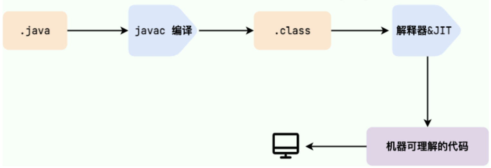

# Java

## 基础

### 从java 8 到 23

https://openjdk.org/projects/jdk/

- java 8（2014）
  - **支持Lamda表达式**
  - **提供Stream API**
  - **接口default关键字，支持接口的默认实现**
  - **引入 `java.time`**
- java 9（2017）
  - 集合工厂方法，如 `List.of()`、`Set.of()` 创建不可变集合
- java 10（2018）
  - 局部变量类型推断（`var`）：简化局部变量声明（需初始化）
  - **G1 作为默认垃圾收集器**：替代 Parallel GC
- java 11（2018）
  - **HTTP Client API**：标准化（原为 Java 9 的孵化器 API）
  - `String` 新增方法：如 `isBlank()`、`lines()`
- java 12（2019）
- java 13（2019）
  - 动态 CDS 归档：提升启动性能
- java 14（2020）
  - **Switch 表达式正式版**：支持箭头语法 `->` 和返回值
- java 15（2020）
  - **ZGC 并发线程处理**：提升 GC 性能，亚毫秒级停顿
    - 并发标记与回收：几乎所有工作（标记、压缩、引用处理）均在用户线程运行时并发执行，极大减少 STW（Stop-The-World）时间
    - 染色指针（Colored Pointers）：在指针中存储元数据（如标记状态），避免传统 GC 的内存屏障开销。
    - 内存映射（Memory Mapping）：通过多阶段内存映射实现快速内存回收
  - **Shenandoah GC**： 低延迟垃圾收集器，设计目标是 将 GC 停顿时间压缩到 10ms 级别，且停顿时间与堆大小无关
    - 并发标记与回收：几乎所有阶段（标记、清理、压缩）均与用户线程并发执行，仅初始标记和最终标记阶段有短暂 STW（Stop-The-World）停顿
    - 转发指针：每个对象头部增加一个指针，指向对象的新地址。移动对象时，用户线程通过转发指针访问最新数据，避免内存自陷开销
    - 连接矩阵：替代 G1 的卡表（Card Table），记录跨 Region 引用，减少内存占用
    - 读写屏障优化：仅引用类型操作触发屏障
- java 16（2021）
  - **Record 类正式版**：简化不可变数据类（替代 Lombok）
  - **模式匹配 instanceof**：直接绑定类型变量，避免强制类型转换（如 `if (obj instanceof String s)`）
- java 17（2021）
  - **Sealed Classes 正式版**：限制类的继承（ `permits` 关键字明确指定允许继承的子类）
- java 18（2022）
- java 19（2022）
- java 20（2023）
- java 21（2023）
  - **虚拟线程正式版**：高并发编程的重大改进
  - 字符串模板（预览）：类似 `STR."Hello \{name}"`
- java 22（2024）
- java 23（2024）
  - 支持markdown格式注解

### java语言特性

- 简单
  - 语法基于C++但更精简，没有指针、多重继承
  - 丰富的类库
  - 自动内存管理
- 面向对象（OOP）
  - 纯面向对象设计，C++则是支持但不强制
- 平台无关性
  - 一次编写、到处运行，代码编译成`.class`后由JVM解释执行
    - JVM基于C/C++编写
- 健壮性
  - 强类型检查
  - 取消指针操作
- 安全性
  - 字节码验证
  - 类加载时隔绝网络与本地类，防止篡改
- 分布式支持
  - 内置网络库`java.net`
- 高性能
  - 解释与编译结合，平衡启动速度和运行性能
    - JIT（Just-In-Time，即时编译）解释执行，并将热点代码编译为机器码（存在代码缓冲区中），提高运行速度
  - 多线程充分利用多核CPU
- 多线程
  - 原生`Thread`类和`synchronized`，支持高并发场景
- 动态性
  - 运行时动态加载类（如通过网络），支持反射和模块化更新
- 丰富的生态
  - 广泛应用于企业级开发（Spring）、大数据（Hadoop）、移动端（Android）等领域

### 常识

#### Java SE 和 Java EE

- **standard edition** VS **enterprise edition**
- Java SE
  - Java 技术的基础，提供核心 API 和 JVM（Java 虚拟机），支持开发桌面应用、命令行工具
  - 包含基础类库（如集合框架、I/O、多线程）和开发工具（如 JDK、JRE）
  - 适用桌面应用（如文本编辑器）、小型服务器程序、嵌入式设备开发
- Java EE
  - 基于 Java SE 扩展，专为大规模分布式系统设计，提供企业级 API（如 Servlet、JSP、EJB）
  - 强调高可用性、安全性和事务管理，适合复杂业务逻辑
  - 适用场景：电商平台、金融系统、微服务架构

#### JVM、JDK和JRE

- JVM
  - Java 虚拟机（Java Virtual Machine, JVM）是运行 Java 字节码的虚拟机。JVM 有针对不同系统的特定实现（Windows，Linux，macOS），目的是使用相同的字节码，它们都会给出相同的结果。字节码和不同系统的 JVM 实现是 Java 语言 “**一次编译，随处可以运行**” 的关键所在
  - JVM不只有一种实现，HotSpot VM是最常见的
- JDK
  - JDK（Java Development Kit）是一个功能齐全的 Java 开发工具包，供开发者使用，用于创建和编译 Java 程序。它包含了 JRE（Java Runtime Environment），以及编译器 javac 和其他工具，如 javadoc（文档生成器）、jdb（调试器）、jconsole（监控工具）、javap（反编译工具）等
- JRE
  - JRE（Java Runtime Environment）是运行已编译 Java 程序所需的环境，主要包括
    - JVM
    - Java 基础类库（Class Library）：一组标准的类库，提供常用的功能和 API（如 I/O 操作、网络通信、数据结构等）

#### 字节码（`.class`）

JVM 可以理解的代码就叫做字节码（即扩展名为 `.class` 的文件），它不面向任何特定的处理器，只面向虚拟机。Java 语言通过字节码的方式，在一定程度上解决了传统解释型语言执行效率低的问题，同时又保留了解释型语言可移植的特点

#### 解释与编译并存

- 编译型：将源代码一次性翻译成可被该平台执行的机器码。一般情况下，编译语言的执行速度比较快，开发效率比较低。常见的编译性语言有 C、C++、Go、Rust
- 解释型：一句一句的将代码解释（interpret）为机器代码后再执行。解释型语言开发效率比较快，执行速度比较慢。常见的解释性语言有 Python、JavaScript、PHP
- Java 解释与编译并存
  - 需要先编译生成`.class`，平台无关性
  - 由JVM解释执行，转换为机器码，平台有关
    - 热点代码的机器码缓存，后续调用直接执行

#### Oracle JDK VS Open JDK

| 对比项         | Oracle JDK                                               | OpenJDK                                                     |
| -------------- | -------------------------------------------------------- | ----------------------------------------------------------- |
| 许可证         | Java 11 起需要商业许可证（开发、测试、个人使用免费）     | 开源，完全免费                                              |
| 开发维护       | Oracle 公司主导，提供官方二进制版本                      | 开源社区（Oracle、Red Hat 等）共同维护，Java SE官方参考实现 |
| 长期支持 (LTS) | 提供长期支持版本（Long-Term Support）                    | 社区或第三方厂商提供免费 LTS 支持                           |
| 性能优化       | 针对企业级场景优化（如 GC 调优、JVM 增强），性能好，稳定 | 性能、稳定性略逊于 Oracle JDK                               |
| 适用场景       | 企业级应用（需商业支持、高稳定性）                       | 个人开发者、云原生、成本敏感项目                            |
| 市场趋势       | 使用率逐年下降（2024 年占 21%）                          | 使用率上升（如 Amazon Corretto、Azul 等厂商版本）           |

#### Java VS C++

以下是 Java 和 C++ 的主要区别对比表格（基于最新信息整理）：

| 对比项     | Java                                    | C++                                                     |
| ---------- | --------------------------------------- | ------------------------------------------------------- |
| 编译与执行 | 编译为字节码，由 JVM 解释执行（跨平台） | 直接编译为机器码（需针对不同平台重新编译）              |
| 面向对象   | 纯面向对象（所有代码必须在类中）        | 支持面向对象和面向过程（可定义全局变量/函数），但不强制 |
| 内存管理   | 自动垃圾回收（GC）                      | 手动管理（`new`/`delete`），易内存泄漏                  |
| 指针支持   | 无指针（仅引用）                        | 支持指针（可直接操作内存）                              |
| 继承机制   | 单继承（通过接口实现多继承效果）        | 支持多继承（可能引发菱形问题）                          |
| 运算符重载 | 不支持                                  | 支持                                                    |
| 预处理     | 无（`import` 类似功能）                 | 支持（`#include`、宏定义）                              |
| 异常处理   | 强制 `try-catch` 结构                   | 灵活格式，若无catch或异常类型不匹配，则向上传播         |
| 性能       | 较慢（依赖 JVM）                        | 更高（直接执行机器码）                                  |
| 应用场景   | 企业应用、Android、Web                  | 系统编程、游戏、高频计算                                |

#### 关键字

| 分类     | 关键字                                                       | 说明                                         |
| -------- | ------------------------------------------------------------ | -------------------------------------------- |
| 访问控制 | `public`、`protected`、`private`                             | 控制类、方法、变量的访问权限                 |
| 类与对象 | `class`、`interface`、`enum`、`extends`、`implements`、`new` | 定义类、接口、枚举及继承关系                 |
| 修饰符   | `static`、`final`、`abstract`、`synchronized`、`transient`、`volatile` | 修饰类、方法、变量的特性（如静态、不可变等） |
| 数据类型 | `byte`、`short`、`int`、`long`、`float`、`double`、`char`、`boolean` | 基本数据类型                                 |
| 流程控制 | `if`、`else`、`switch`、`case`、`default`、`for`、`while`、`do` | 条件分支和循环结构                           |
| 跳转控制 | `break`、`continue`、`return`                                | 控制代码执行流程                             |
| 异常处理 | `try`、`catch`、`finally`、`throw`、`throws`                 | 捕获和处理异常                               |
| 包与导入 | `package`、`import`                                          | 管理代码组织和依赖                           |
| 其他     | `this`、`super`、`instanceof`、`native`、`strictfp`          | 引用当前对象、父类、类型检查等               |
| 保留字   | `goto`、`const`                                              | 无实际用途，禁止作为标识符                   |
| 特殊值   | `true`、`false`、`null`                                      | 布尔值和空引用（非关键字，但为保留字）       |

#### 运算符

| 分类       | 运算符                                                       | 说明                                                      |
| ---------- | ------------------------------------------------------------ | --------------------------------------------------------- |
| 算术运算符 | `+`、`-`、`*`、`/`、`%`、`++`、`--`                          | 基本数学运算，支持自增/自减（前缀与后缀效果不同）         |
| 关系运算符 | `==`、`!=`、`>`、`<`、`>=`、`<=`                             | 比较操作数，返回布尔值（`true`/`false`）                  |
| 逻辑运算符 | `&&`、`||`、`!`                                              | 布尔逻辑运算，支持短路特性（提前结束表达式判断）          |
| 位运算符   | `&`、`|`、`^`（异或）、`~`（按位取反）、`<<`、`>>`、`>>>`    | 二进制位操作                                              |
| 赋值运算符 | `=`、`+=`、`-=`、`*=`、`/=`、`%=`、`&=`、`|=`、`^=`（异或）、`<<=`、`>>=`、`>>>=` | 赋值与运算相结合                                          |
| 条件运算符 | `? :`                                                        | 三元运算符（简化 `if-else`，如 `a > b ? a : b`）          |
| 类型检查   | `instanceof`                                                 | 判断对象是否属于某个类/接口（如 `obj instanceof String`） |
| 其他       | `->`（Lambda 表达式）、`::`（方法引用）                      | 函数式编程支持                                            |

### 数据类型

| 基本类型  | 包装类型    | 位数 | 字节 | 取值范围/默认值                     | 缓存机制           | 主要区别                                                 |
| --------- | ----------- | ---- | ---- | ----------------------------------- | ------------------ | -------------------------------------------------------- |
| `byte`    | `Byte`      | 8    | 1    | −128 ~ 127 (默认 `0`)               | `-128` ~ `127`     | 基本类型直接存值，包装类型是对象（可`null`）             |
| `short`   | `Short`     | 16   | 2    | −32768 ~ 32767 (默认 `0`)           | `-128` ~ `127`     | 包装类型支持方法（如`parseShort()`），基本类型不支持     |
| `int`     | `Integer`   | 32   | 4    | −231 ~ 231−1 (默认 `0`)             | `-128` ~ `127`     | 自动装箱调用`valueOf()`，拆箱调用`intValue()`            |
| `long`    | `Long`      | 64   | 8    | −263 ~ 263−1 (默认 `0L`)            | `-128` ~ `127`     | 字面量需加`L`（如`100L`）                                |
| `float`   | `Float`     | 32   | 4    | ±3.4e+38 (默认 `0.0f`)              | 无缓存             | 浮点数比较需用`Float.compare()`，避免精度误差            |
| `double`  | `Double`    | 64   | 8    | ±1.8e+308 (默认 `0.0d`)             | 无缓存             | 包装类型可用于集合（如`List<Double>`），基本类型不能     |
| `char`    | `Character` | 16   | 2    | `\u0000` ~ `\uffff` (默认 `\u0000`) | `0` ~ `127`        | `char`可参与算术运算（转为`int`）                        |
| `boolean` | `Boolean`   | 1    | 1/8  | `true`/`false` (默认 `false`)       | `true`/`false`缓存 | 包装类型提供逻辑方法（如`Boolean.parseBoolean("true")`） |

>  在c++中，char是一个字节，基于ASCII；java的char编码基于Unicode（UTF-16）

#### 自动装箱与拆箱

- 装箱：将基本类型用它们对应的引用类型包装起来（`int a = 10; Integer b = a;`，实际调用`Integer.valueOf(a)`）
- 拆箱：将包装类型转换为基本数据类型（`Integer c = 20; int d = c;`，实际调用`c.intValue()`）

#### 缓存机制

`Byte`、`Short`、`Integer`、`Long`缓存了`-128`~`127`的值，会复用对象（如`Integer.valueOf(100) == Integer.valueOf(100)`为`true`）

#### 存储位置

- static修饰
  - jdk 1.7及以前，在方法区
  - jdk 1.8以后，在元空间（方法区的替代实现）
- 未被static修饰
  - 基本数据类型
    - 局部变量：栈
    - 成员变量：堆（变量->对象实例->堆）
  - 包装类型：堆

#### 浮点数的精度损失

某些数字使用二进制表示会无限循环，然而实际存储位数有限，因此会截断，导致精度损失

使用[BigDecimal](#BigInteger 和 BigDecimal)避免此问题

#### BigInteger 和 BigDecimal