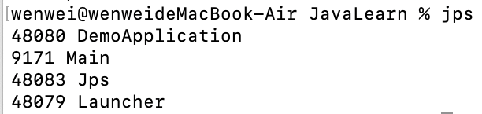
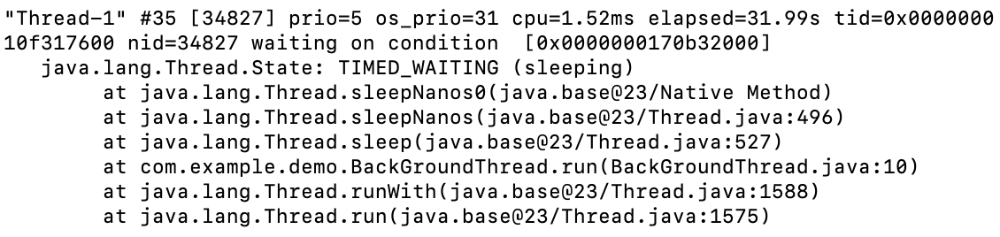
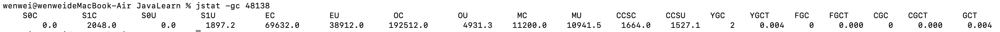
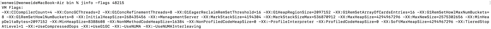
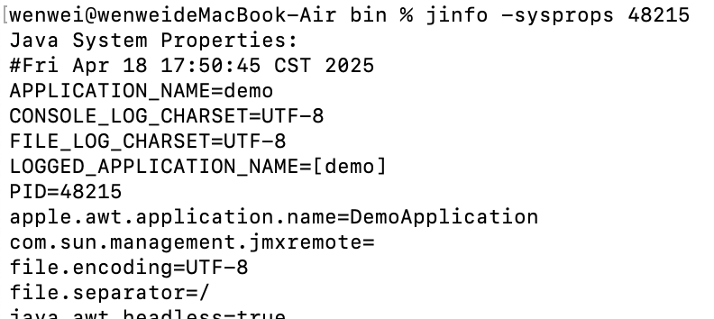

# Java常用运维工具

## JDK自带

### jps——有哪些java进程

列出当前系统中所有的 Java 进程及其相关信息

### jstack——线程、堆栈

用于生成 Java 虚拟机当前时刻的线程快照

- 线程名：`Thread-1`（建议使用有意义的名称）

- 线程ID：`#35`
- 操作系统线程ID：`34827`
- 优先级：`prio=5`（普通优先级）
- CPU时间：`cpu=1.52ms`（消耗很少）
- 存活时间：`elapsed=31.99s`
- `TIMED_WAITING (sleeping)`：线程正在睡眠状态
- `waiting on condition`：等待条件（这里是主动sleep）
- 最顶层是`Thread.sleepNanos0`（本地方法）
- 调用链显示最终来自`BackGroundThread.run(BackGroundThread.java:10)`

### jstat——运行时统计信息

监控 JVM 的各种运行时统计信息，包括 **堆内存、垃圾回收（GC）、类加载、JIT 编译** 等

#### gc

- S*：Survivor区
- E*：Eden区
- O*：老年代
- M*：metaspace

|   参数   |   示例值   |                    说明                    |
| :------: | :--------: | :----------------------------------------: |
| **YGC**  |    `2`     |             Young GC 发生次数              |
| **YGCT** | `0.004` 秒 |              Young GC 总耗时               |
| **FGC**  |    `0`     |              Full GC 发生次数              |
| **FGCT** | `0.000` 秒 |               Full GC 总耗时               |
| **CGC**  |    `0`     | Concurrent GC 次数（如 G1/CMS 的并发阶段） |
| **CGCT** | `0.000` 秒 |             Concurrent GC 耗时             |
| **GCT**  | `0.004` 秒 |               所有 GC 总耗时               |

### jmap

#### JDK 9.0以前

#### JDK9.0以后

### jinfo——查看JVM参数

查看和修改运行中的 Java 进程的 JVM 参数

#### flags——所有JVM参数

#### sysprops——所有系统属性

### jcmd

### VisualVM

## **Arthas**

## Eclipse Memory Analyzer (MAT)