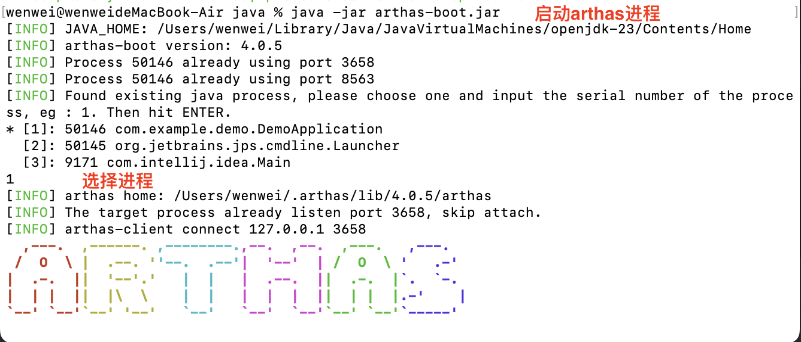
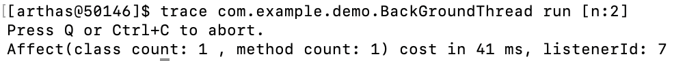
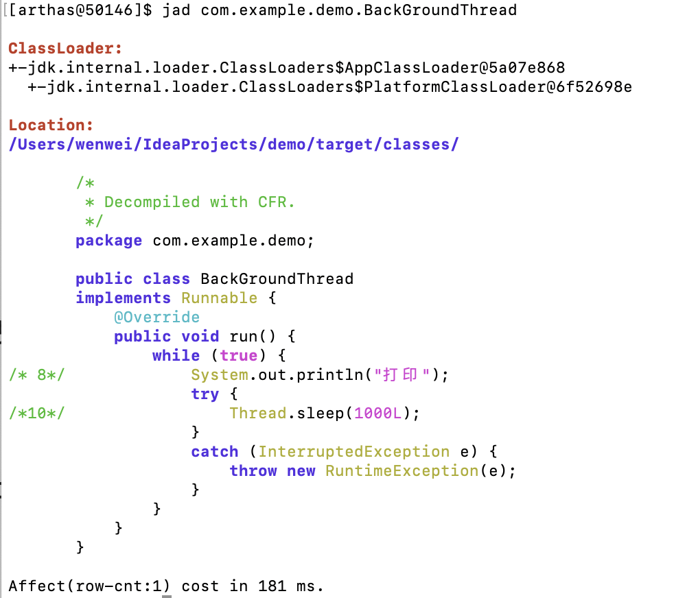

# Java常用运维工具

## JDK自带

### jps——有哪些java进程

列出当前系统中所有的 Java 进程及其相关信息


### jstack——线程、堆栈

用于生成 Java 虚拟机当前时刻的线程快照


- 线程名：`Thread-1`（建议使用有意义的名称）

- 线程ID：`#35`
- 操作系统线程ID：`34827`
- 优先级：`prio=5`（普通优先级）
- CPU时间：`cpu=1.52ms`（消耗很少）
- 存活时间：`elapsed=31.99s`
- `TIMED_WAITING (sleeping)`：线程正在睡眠状态
- `waiting on condition`：等待条件（这里是主动sleep）
- 最顶层是`Thread.sleepNanos0`（本地方法）
- 调用链显示最终来自`BackGroundThread.run(BackGroundThread.java:10)`

### jstat——运行时统计信息

监控 JVM 的各种运行时统计信息，包括 **堆内存、垃圾回收（GC）、类加载、JIT 编译** 等

#### gc


- S*：Survivor区
- E*：Eden区
- O*：老年代
- M*：metaspace

|   参数   |   示例值   |                    说明                    |
| :------: | :--------: | :----------------------------------------: |
| **YGC**  |    `2`     |             Young GC 发生次数              |
| **YGCT** | `0.004` 秒 |              Young GC 总耗时               |
| **FGC**  |    `0`     |              Full GC 发生次数              |
| **FGCT** | `0.000` 秒 |               Full GC 总耗时               |
| **CGC**  |    `0`     | Concurrent GC 次数（如 G1/CMS 的并发阶段） |
| **CGCT** | `0.000` 秒 |             Concurrent GC 耗时             |
| **GCT**  | `0.004` 秒 |               所有 GC 总耗时               |

### jmap——查看堆内存

#### -heap堆内存概览

`jmap -heap <pid>`

#### -dump生成堆转储文件

`jmap -dump:live,format=b,file=heap.hprof <pid>`


### jinfo——查看JVM参数

查看和修改运行中的 Java 进程的 JVM 参数

#### flags——所有JVM参数


#### sysprops——所有系统属性


### jcmd——多功能JVM诊断工具

整合了`jps`、`jstack`、`jmap`等命令的功能，并支持更多扩展操作

### VisualVM——Java 性能分析和监控工具

集成于 JDK 中，支持本地和远程 JVM 监控

## Arthas

https://arthas.aliyun.com/doc/

**生产环境中的在线问题排查**

### 典型场景

1. 这个类从哪个 jar 包加载的？为什么会报各种类相关的 Exception？
2. 我改的代码为什么没有执行到？难道是我没 commit？分支搞错了？
3. 遇到问题无法在线上 debug，难道只能通过加日志再重新发布吗？
4. 线上遇到某个用户的数据处理有问题，但线上同样无法 debug，线下无法重现！
5. 是否有一个全局视角来查看系统的运行状况？
6. 有什么办法可以监控到 JVM 的实时运行状态？
7. 怎么快速定位应用的热点，生成火焰图？
8. 怎样直接从 JVM 内查找某个类的实例？

### 常用命令

#### 启动



#### dashboard（线程信息、内存使用、运行环境）


#### trace（追踪方法调用链耗时）

```
trace com.example.service.UserService getUserById
```



#### jad（反编译线上代码）

```shell
jad com.example.controller.UserController
```



#### watch（监控方法入参、返回值）

#### thread（查看线程信息、堆栈）

`thread`命令直接查看线程信息：


`thread id`查看指定线程id的堆栈信息：


#### redefine（热更新代码）

将指定.class文件替换JVM已加载.class文件

`redefine /Users/wenwei/IdeaProjects/demo/target/classes/com/example/demo/BackGroundThread.class`


#### monitor（方法调用统计）

```sh
monitor -c 60 com.example.service.UserService getUserById
```

#### profile（生成火焰图）

```sh
# 生成 CPU 火焰图（定位性能瓶颈）
profiler start
profiler stop --format html
```


##### 火焰图核心解读逻辑

1. **横轴（宽度）**：
   1. 表示CPU时间占比，越宽的方法消耗资源越多
2. **纵轴（高度）**：
   1. 显示调用栈深度，**底部为入口方法，顶部为最终执行逻辑**
   2. 典型问题模式：
      1. 平顶现象：顶部宽条表示自身逻辑耗时高（需直接优化）
      2. 锯齿边缘：频繁短时函数调用（考虑批量处理）
3. **颜色标识**：
   1. 绿色：Java业务代码
   2. 黄色：JVM的C++代码
   3. 橙色：内核态C代码
   4. 红色：用户态C代码

## Eclipse Memory Analyzer (MAT)